# Contributing guidelines

## Contribution rules

We encourage you to use AI tools for coding help, but pull request descriptions and issues MUST be written in your own words. We need to understand what you changed, why you changed it, and how you verified it without having to review a large AI-generated explanation.

Open a discussion before starting changes that affect project direction, for examples:

- Adding or replacing dependencies.
- Changing authentication, installation, packaging, PAM, or application flows.
- Introducing a new feature or changing existing behavior.
- Large refactors that make behavior hard to review.

The discussion should explain the problem, the proposed solution, expected impact, and any distro-specific risks. Pull requests without clear evidence for the change may be closed.

AI-like issues or pull requests, including generic generated text, vague impact statements, or submissions that do not show personal understanding of the change, will be closed as not planned.

## 1. How to Run

Biopass consists of a backend C++ authentication module and a frontend Tauri desktop application. You will need to install dependencies for both.

### Install Dependencies

**For the C++ Backend:**

You need to install CMake, Make, PAM headers, CLI11, libjpeg-turbo, and the build tools libcamera needs.

```bash
sudo apt update
sudo apt install cmake make g++ pkg-config libpam0g-dev libcli11-dev libturbojpeg0-dev \
  meson ninja-build python3-jinja2 python3-yaml python3-ply  libudev-dev libdrm-dev
```

**For the Tauri Application:**

You need to install [Bun](https://bun.sh/), Rust/Cargo, and system UI dependencies.
```bash
# Install Bun
curl -fsSL https://bun.sh/install | bash

# Install Rust
curl --proto '=https' --tlsv1.2 -sSf https://sh.rustup.rs | sh

# Install Tauri prerequisites (Ubuntu/Debian)
sudo apt install libwebkit2gtk-4.1-dev build-essential curl wget file libxdo-dev libssl-dev libayatana-appindicator3-dev librsvg2-dev
```

### Building the Project

The root directory includes a `Makefile` that orchestrates the entire build process.

To build the C++ backend (`auth` module):
```bash
make build-auth
```

To build both the C++ backend and the Tauri frontend:
```bash
make build
```

To package the application into Linux release artifacts (`.deb` and `.rpm`)
```bash
make package
```

### Running the Desktop App in Dev Mode

To run the Tauri app locally with hot module replacement (HMR), use the following commands:
```bash
cd app
bun install
bun run tauri dev
```

## 2. Tech Stack

### Backend Authentication Module (`auth/`)
- **C++17**
- **CMake**
- **libcamera**: built from source at a pinned version and bundled into the package (see
  `auth/BundleLibcamera.cmake`) instead of linked against the system's copy, since libcamera's C++ ABI
  breaks across minor versions.
- **ONNX Runtime**: runs the machine learning models (YOLO for detection, EdgeFace for recognition, MobileNetV3 for anti-spoofing).
- **Linux PAM**

### Desktop Application (`app/`)
- **Tauri v2**
- **Rust**
- **Vite & React**
- **TypeScript**
- **TailwindCSS**

## 3. Architecture and Flow

The Biopass system is split into two primary layers: **The Backend Authentication Module** and the **Desktop UI Engine**.

```mermaid
sequenceDiagram
    participant OS as Linux Login/Sudo (PAM)
    participant Lib as libbiopass_pam.so
    participant Helper as biopass-helper
    participant Sensors as Camera/Mic/Fingerprint
    participant TauriBackend as Tauri Rust Backend
    participant ReactUI as React Frontend

    rect rgb(30, 41, 59)
    Note over OS,Sensors: Backend Authentication Flow
    OS->>Lib: Authenticate User
    Lib->>Helper: Spawn Isolated Process
    Helper->>Sensors: Capture Biometrics
    Sensors-->>Helper: Return Data
    Helper->>Helper: Run Local Inference
    Helper-->>Lib: Return Exit Code (0 for Success)
    Lib-->>OS: PAM_SUCCESS or PAM_AUTH_ERR
    end

    rect rgb(31, 41, 55)
    Note over TauriBackend,ReactUI: Desktop Management Flow
    ReactUI->>TauriBackend: Update Config/Register Biometrics
    TauriBackend->>Sensors: Capture Biometrics
    Sensors-->>TauriBackend: Return Reference Data
    TauriBackend-->>ReactUI: Save to ~/.../config.yaml
    end
```



### Directory Structure

```text
biopass/
├── app/                  # The Tauri Desktop Application
│   ├── src/              # React frontend (Vite + TypeScript + Tailwind)
│   ├── src-tauri/        # Rust backend bridging system calls and the UI
│   └── tauri.conf.json   # Configuration for the desktop bundle
│
├── auth/                 # The C++ Backend Authentication Module
│   ├── core/             # Shared classes (logging, config parsing)
│   ├── face/             # Implementation of the face auth module (Yolo, EdgeFace, MobileNetV3)
│   ├── fingerprint/      # Implementation of the fingerprint auth module
│   ├── pam/              # PAM module integration logic (`libbiopass_pam.so` and `biopass-helper`)
│   └── CMakeLists.txt    # Build orchestration for the auth module
│
├── docs/                 # Documentation (Contributing, Architecture)
└── Makefile              # Root build orchestrator (calls CMake and Tauri build commands)
```

## 4. Development Warnings and Debugging

When you need to modify the C++ PAM logic, we recommend you enable the `debug` flag in the configuration. You may open the UI app and toggle **Debug Mode** to ON, or manually edit `~/.config/com.ticklab.biopass/config.yaml`. When the debug flag is enabled, detailed logs are printed, and face captures that fail authentication (or get caught spoofing) are saved as `.bmp` images to `~/.local/share/com.ticklab.biopass/debugs/`.

### ⚠️ System Lockout Warnings

Editing your distro PAM include file (typically `/etc/pam.d/common-auth` on Debian/Ubuntu or `/etc/pam.d/system-auth` on Fedora) incorrectly may **lock you out of your system permanently**. Be extremely careful when manually testing new PAM libraries. Use one of the following methods to prevent lockout:

- Use a Virtual Machine: It is strongly recommended to use a Linux VM (e.g QEMU + KVM) for development. This allows you to take snapshot rollbacks if a module crashes or corrupts the PAM stack. Notice that fingerprint devices usually cannot be passed through to a virtual machine.
- Grant write permission to the PAM file you are testing, for example: `sudo chown $USER:root /etc/pam.d/common-auth` and `sudo chmod 644 /etc/pam.d/common-auth`.
- Rescue USB: Use a rescue USB to mount the filesystem and manually fix the configuration files if you accidentally reboot into a locked system.
