# Contributing guidelines

Welcome to Biopass! We appreciate your interest in contributing. This guide outlines how to get the project running locally, explains the core architecture, and provides important debugging guidelines.

## 1. How to Run

Biopass consists of a backend C++ authentication module and a frontend Tauri desktop application. You will need to install dependencies for both.

### Install Dependencies

**For the C++ Backend:**

You need to install CMake, Make, OpenCV, PAM headers, and CLI11.
```bash
sudo apt update
sudo apt install cmake make g++ libopencv-dev libpam0g-dev libcli11-dev
```

**For the Tauri Application:**

You need to install [Bun](https://bun.sh/), Rust/Cargo, and system UI dependencies.
```bash
# Install Bun
curl -fsSL https://bun.sh/install | bash

# Install Rust
curl --proto '=https' --tlsv1.2 -sSf https://sh.rustup.rs | sh

# Install Tauri prerequisites (Ubuntu/Debian)
sudo apt install libwebkit2gtk-4.1-dev build-essential curl wget file libxdo-dev libssl-dev libayatana-appindicator3-dev librsvg2-dev
```

### Building the Project

The root directory includes a `Makefile` that orchestrates the entire build process.

To build the C++ backend (`auth` module):
```bash
make build-auth
```

To build both the C++ backend and the Tauri frontend:
```bash
make build
```

To easily package the application into a `.deb` file:
```bash
make package
```

### Running the Desktop App in Dev Mode

To run the Tauri app locally with hot module replacement (HMR), use the following commands:
```bash
cd app
bun install
bun run tauri dev
```

## 2. Tech Stack

Biopass is built using modern and reliable technologies across both the backend logic and the desktop management application.

### Backend Authentication Module (`auth/`)
- **C++17**: High performance system-level execution.
- **CMake**: Build system.
- **OpenCV**: Image and frame processing for face authentication.
- **LibTorch (PyTorch C++)**: Running the machine learning models (YOLO for detection, EdgeFace for recognition, MobileNetV3 for anti-spoofing).
- **Linux PAM**: Pluggable Authentication Module integration for the OS.

### Desktop Application (`app/`)
- **Tauri v2**: Lightweight and secure desktop framework bridging the backend and frontend.
- **Rust**: Systems programming for the Tauri backend (invoking configurations, paths, etc.).
- **Vite & React**: Fast frontend UI framework for managing biometric settings.
- **TypeScript**: Type-safe logic for the UI.
- **TailwindCSS**: UI styling and layout.

## 3. Architecture and Flow

The Biopass system is split into two primary layers: **The Backend Authentication Module** and the **Desktop UI Engine**.

```mermaid
sequenceDiagram
    participant OS as Linux Login/Sudo (PAM)
    participant Lib as libbiopass_pam.so
    participant Helper as biopass-helper
    participant Sensors as Camera/Mic/Fingerprint
    participant TauriBackend as Tauri Rust Backend
    participant ReactUI as React Frontend

    rect rgb(30, 41, 59)
    Note over OS,Sensors: Backend Authentication Flow
    OS->>Lib: Authenticate User
    Lib->>Helper: Spawn Isolated Process
    Helper->>Sensors: Capture Biometrics
    Sensors-->>Helper: Return Data
    Helper->>Helper: Run Local Inference
    Helper-->>Lib: Return Exit Code (0 for Success)
    Lib-->>OS: PAM_SUCCESS or PAM_AUTH_ERR
    end

    rect rgb(31, 41, 55)
    Note over TauriBackend,ReactUI: Desktop Management Flow
    ReactUI->>TauriBackend: Update Config/Register Biometrics
    TauriBackend->>Sensors: Capture Biometrics
    Sensors-->>TauriBackend: Return Reference Data
    TauriBackend-->>ReactUI: Save to ~/.../config.yaml
    end
```



### The PAM Module (`auth/`)

### Directory Structure

The repository is organized by separating the backend systems-level logic from the frontend desktop application logic.

```text
biopass/
├── app/                  # The Tauri Desktop Application
│   ├── src/              # React frontend (Vite + TypeScript + Tailwind)
│   ├── src-tauri/        # Rust backend bridging system calls and the UI
│   └── tauri.conf.json   # Configuration for the desktop bundle
│
├── auth/                 # The C++ Backend Authentication Module
│   ├── core/             # Shared classes (logging, config parsing)
│   ├── face/             # Implementation of the face auth module (Yolo, EdgeFace, MobileNetV3)
│   ├── fingerprint/      # Implementation of the fingerprint auth module
│   ├── voice/            # Implementation of the voice auth module 
│   ├── pam/              # PAM module integration logic (`libbiopass_pam.so` and `biopass-helper`)
│   └── CMakeLists.txt    # Build orchestration for the auth module
│
├── docs/                 # Documentation (Contributing, Architecture)
└── Makefile              # Root build orchestrator (calls CMake and Tauri build commands)
```

## 4. Development Warnings and Debugging

If you are modifying the C++ PAM logic, you should enable the `debug` flag in the configuration.
1. Open the UI app and toggle **Debug Mode** to ON, or manually edit `~/.config/com.ticklab.biopass/config.yaml`.
2. When the debug flag is enabled, detailed logs are printed, and face captures that fail authentication (or get caught spoofing) are saved as `.jpg` images to `~/.local/share/com.ticklab.biopass/debugs/`.

### ⚠️ System Lockout Warnings

Editing the `/etc/pam.d/common-auth` file incorrectly may **lock you out of your system permanently**. Be extremely careful when manually testing new PAM libraries. Use one of the following methods to prevent lockout:

- Use a Virtual Machine: It is strongly recommended to use a Linux VM (e.g QEMU + KVM) for development. This allows you to take snapshot rollbacks if a module crashes or corrupts the PAM stack. Notice that fingerprint devices usually cannot be passed through to a virtual machine.
- Grant write permission to the PAM file: `sudo chown $USER:root /etc/pam.d/common-auth` and `sudo chmod 644 /etc/pam.d/common-auth`.
- Rescue USB: Use a rescue USB to mount the filesystem and manually fix the configuration files if you accidentally reboot into a locked system.
